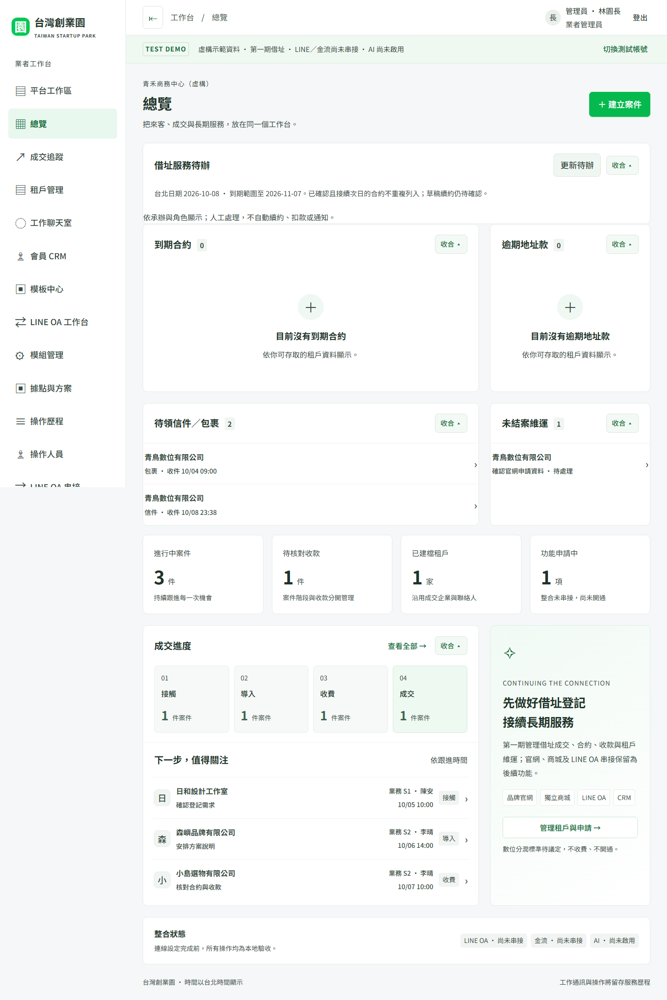
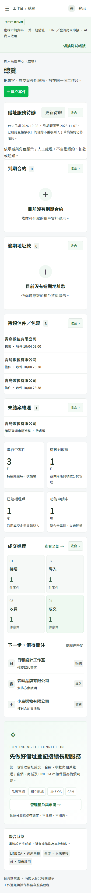

# 借址服務待辦

## 2026-10-08 23:55（台北）發布核對

- [功能 PR #20](https://github.com/fangwl591021/taiwan-startup-park/pull/20) 與 [部署修正 #21](https://github.com/fangwl591021/taiwan-startup-park/pull/21) 已合併至 release/cloudflare。
- [正式發布 37804208460](https://github.com/fangwl591021/taiwan-startup-park/actions/runs/37804208460) build／deploy 均 success；來源 `7e7b264b764c7190122587555cf36ee3626c6917`。
- 2,011 項測試：根後端 139、桌面／手機 42、來源後端 1,222、來源前端 592、實際 runtime 12、runtime 瀏覽器 4；typecheck、audit、來源 hash、schema 與完整 Worker dry-run 通過。
- 正式 active：`75053c04-ee0d-4b38-aaa0-e89770360cbe`；demo active：`c3175c41-58eb-464a-8bf9-9e3f5d3b609d`（含既有 demo gate secret 的發布版本）。
- 四個正式／demo 專用資料庫均無待套用 migration；保留既有資料與加密主鑰，分潤全 NULL、結算及 LINE 外送關閉。
- 兩站未登入 dashboard API 皆 Access 302；signed webhook 邊界、管理員身分及真實綁定核對通過。UI 驗收使用本機隔離虛構資料，未代替本人登入正式 UI。
- 首次發布在舊單 DB 判斷處停止，尚未修改遠端資料；修正後核對根 DB 與已記錄平台 DB ID、名稱／UUID，錯誤或混用仍拒絕。完整平台無有效 owner 時不退回初始化部署。

入口：[正式站](https://taiwan-startup-park.fangwl591021.workers.dev/) → 業者工作台 → 總覽 → 借址服務待辦。

## 操作範圍

業者工作台的「總覽」自動載入待辦，可按「更新待辦」取得最新台帳。每列開啟同一租戶的合約、帳務、信件或維運分類；沿用既有操作、人工核對與歷程。

- 到期合約：已確認、已開始，結束日在台北今天起 30 天內或已過期。若同據點有已確認且從次日接續的合約，舊期不重複列入。草稿續約、間隔期間仍需處理。
- 逾期地址款：付款期限早於台北今天、未作廢且淨實收不足。部分收款與退款即時影響待收；數位訂閱款不列入。今日到期尚不算逾期。
- 待領信件／包裹：已收件或待領取；完成領取、轉寄、退回即移出。
- 未結案維運：待處理、處理中及已解決但未結案；結案即移出。

各類先顯示最早 10 筆及完整筆數；維運依高、一般、低優先順序排列。超過上限會提示到租戶管理查看其餘紀錄。待辦列表不包含收付款憑據、信件正文、聯絡資料或私有風控內容。

管理員看本業者；業務沿用案件／服務指派；維運只看承辦租戶，不提供逾期款項；財務不提供信件與維運需求。平台或企業角色沒有隱含存取權。取消指派或停權後由伺服器重新校驗，API 保持 no-store。

本輪無新增 migration、排程、外送、收費或自動續約。沿用借址第一期與未議定分潤界線。dev.mjs 的靜態資源路徑判斷另修正為跨 Windows／Linux，仍阻擋跳出資源目錄。

驗收：新增日期邊界、續期確認、收退款、角色／業者隔離與列表上限測試，以及桌面／手機真實本機 API 開啟租戶分類驗收；截圖使用隔離虛構資料。
