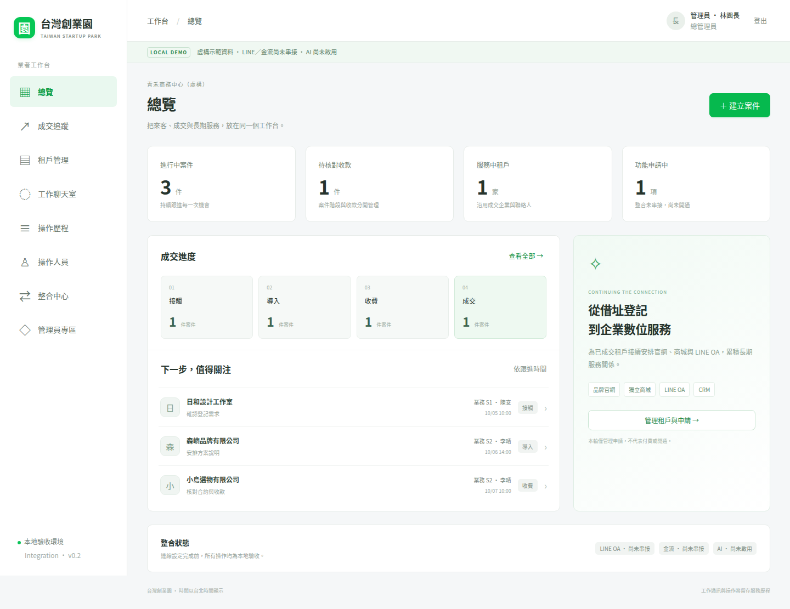
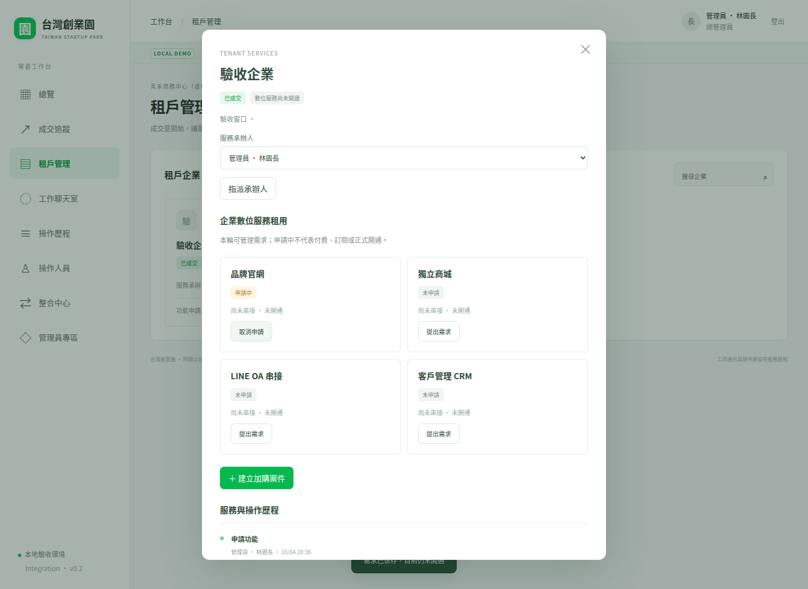
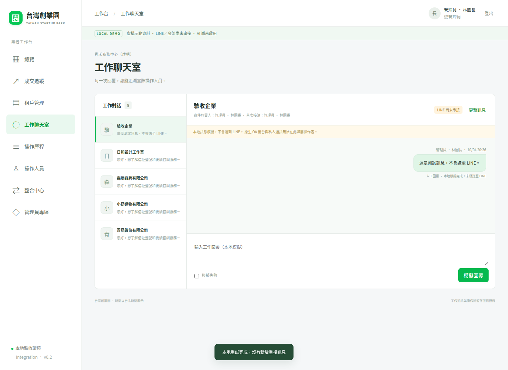
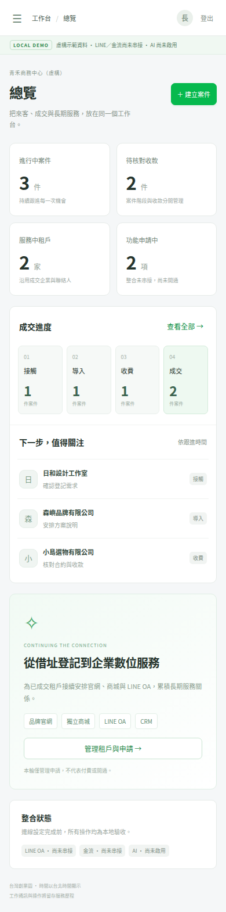
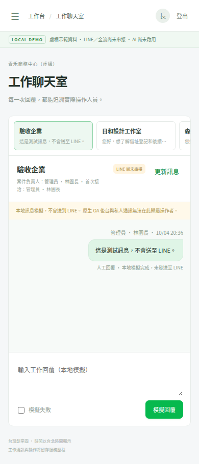

# Foundation 驗收紀錄

日期：2026-10-04。分支：feature/foundation。草稿 PR：[#2](https://github.com/fangwl591021/taiwan-startup-park/pull/2)。

完整驗收：[GitHub Actions 37199943811](https://github.com/fangwl591021/taiwan-startup-park/actions/runs/37199943811)，結果 success。
實測程式 commit：96fe88c76ef114f5afcbbd553b00a31299117117。
證據保存 commit：5befc64af300cce110d16f4f6c08706138831eb5（只增加套件鎖與截圖）。
其後文件／CI 整理不更動應用行為，CI 改為 npm ci 並移除寫入分支權限。

## 已執行
- TypeScript typecheck：通過。
- 前端與 Worker 建置：通過。
- Worker Wrangler dry-run：通過；沒有部署。
- 後端權限及核心流程：14 / 14 通過。
- Playwright Chromium 桌面／手機：3 / 3 通過。
- npm audit：0 vulnerabilities（當次鎖定依賴檢查）。
- 6 張實際瀏覽器截圖已逐一目視檢查，非生成 mockup。
- 原規格 blob SHA fcc87b90c7cc7ec6e3a5126f461fbd6ae923203b，完整保留未修改。

本地執行容器無法啟動 shell，已改用此 repo 的 GitHub Actions 執行及保存證據。
CI 環境：Ubuntu、Node.js 22.23.3、Chromium、Noto CJK 字型。
沒有把尚未執行的正式外部整合列為通過。

## 核心測試覆蓋
| 驗收項目 | 結果 |
| --- | --- |
| A 業者不可存取 B 的列表、詳情、訊息、歷程、寫入 | 通過 |
| 業務依案件、維運依承辦租戶、財務不讀聊天室 | 通過 |
| 業務直接呼叫風控 API 被拒；一般資料無風控欄位 | 通過 |
| platform_admin 不默認取得跨業者資料 | 通過 |
| 偽造 actor_id、operator_id、role、AI 來源被拒 | 通過 |
| 建立企業、聯絡人與案件、搜尋篩選與跨 session 持久讀取 | 通過 |
| 階段、未成交原因與版本衝突 | 通過 |
| 第二筆成交沿用企業與窗口、重送成交不重複 | 通過 |
| 成交、付款、數位功能未開通三者獨立 | 通過 |
| S1 轉交、S2 回覆、S3 接手保留歷史操作者 | 通過 |
| 模擬失敗仍為失敗，重試與重送不重複可見訊息 | 通過 |
| 功能申請去重、取消、禁止直接標記啟用 | 通過 |
| 停權阻止既有 session 新操作並保存歷史歸屬 | 通過 |
| production / 非 loopback 關閉示範登入，CSRF 拒絕 | 通過 |
| SQLite 原子批次回滾、複合外鍵防跨業者關聯 | 通過 |
| 同版本併發寫入僅一筆成功及一筆操作事件 | 通過 |
| 手機導覽、表單錯誤、空狀態、頁面無橫向溢出 | 通過 |
| 訊息 HTML 內容不被當成 HTML 執行 | 通過 |

## 桌面

## 手機

桌面 1440 × 1050 viewport；手機 390 × 844 viewport；截圖包含完整頁面。
手機截圖在桌面流程之後拍攝，所以可看到新成交的虛構驗收企業。

## 尚未驗證／尚未串接
正式 IdP、Cloudflare 真實 D1 runtime/遠端 migrations、LINE Webhook/Messaging API、
金流交易與回呼、AI/風控模型、實際官網或商城開通、通知排程。
本輪只驗證 Worker 相容 handler + D1 介面 SQLite adapter，及本地模擬訊息。
沒有部署、覆蓋正式 Worker，沒有要求或使用正式 LINE／金流／AI 金鑰。
