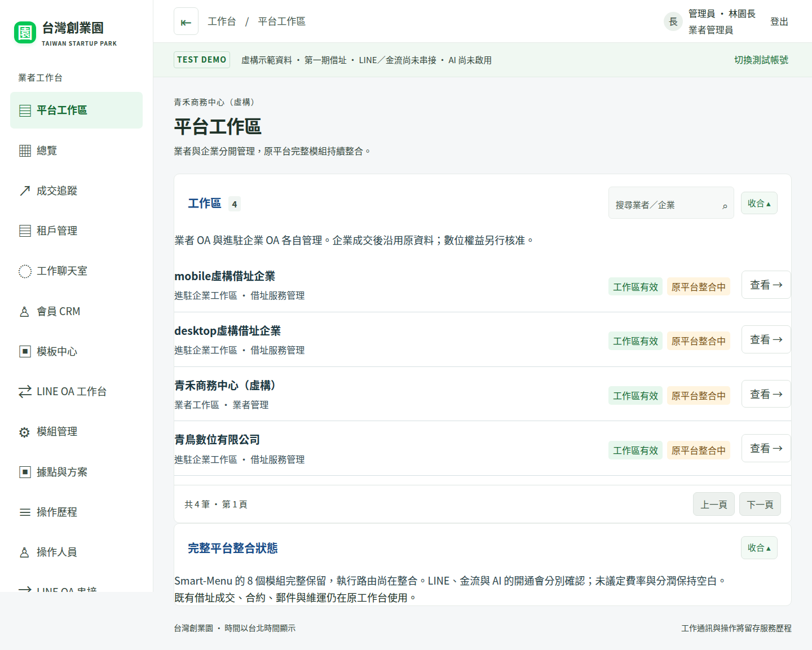
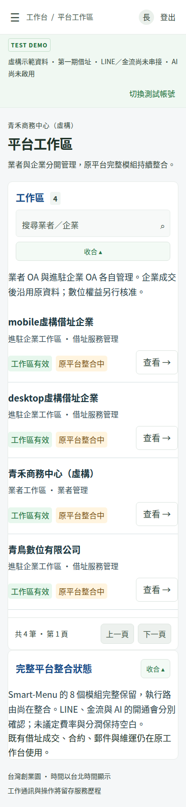

# Smart-Menu-Studio 完整平台移植與借址模型

日期：2026-10-08（Asia/Taipei）

## 目前狀態

使用者已確認：以整套 Smart-Menu-Studio 為平台基底，再增加借址登記模型。不能以選單名稱、少數 LINE 功能或畫面規劃代替完整移植。

已保存完整來源基準，並開始實作既有登入與業者／企业工作區權限橋接；原平台執行路由和完整資料整合仍未完成。現有正式 Worker 仍使用既有借址系統；此分支的原平台程式尚未提供正式服務。

- 來源：fangwl591021/Smart-Menu-Studio，main / f69fd70a2ff91056bbac158a41e046ee35f10077。
- 來源 tree：dbcc440b081bcdeb11aa98d1ebac06e0e7300ea1。
- 目標起點：release/cloudflare / e24b74f1fbce1a2b01f8784ec1f2664c3db6b2e5。
- 完整保存 369 個來源檔案，包括二進位素材、WASM、前後端、鎖檔、原有測試、55 份 migrations。
- 路徑：platform/upstream-smart-menu。每個檔案保持原 Git blob SHA；config/platform-source-lock.json 記錄版本及完整清單。
- 保留 docs/PLATFORM_BLUEPRINT.md 及既有成交、合約、郵件、LINE、風控功能。來源 migrations 不放進根目錄 migrations，也不套用正式 D1。
- 本機環境仍顯示 environment_offline，終端及瀏覽器工具未提供；以 GitHub 保存實作，透過 Actions 執行建置、資料及瀏覽器驗收。原平台完整執行整合尚待繼續。
- 原平台的既有測試和建置不代表新的業者／企業權限及借址整合已通過。

## 完整功能範圍

原平台明確定義 8 個權益模組。以下全部保留；與借址業務暫無直接關係的功能仍保留在平台基底，依方案決定是否顯示或開通，不刪除原有能力。

| 模組／領域 | 原有程式能力 | 借址平台對應與驗收 |
| --- | --- | --- |
| CORE_MENU | 圖文選單專案、範本、上傳素材、版型辨識、熱區、發布、預設選單、停用恢復 | 業者 OA 與企業自有 OA 各自授權；不共用發送憑證或素材 |
| CRM | 統一顧客、匯入去重、名片收藏分享、來源／承辦人、標籤洞察、追蹤流程、時間軸、分群分析 | 潛客到借址成交及進駐企業同一資料關係；保留聯絡人、歷史實際操作者與指派範圍 |
| CAMPAIGN | 活動編輯、受眾快照、內容準備、LINE 執行、重試、發送紀錄、追蹤連結 | 郵件代收通知及續約提醒另用服務型訊息；不可因建立活動即正式群發 |
| COMMERCE | 商品、訂單、付款義務、藍新介面、會員訂單、轉換來源 | 各企業商城隔離；借址款、數位訂閱款、商品款分開，憑證與回呼未驗證不得開通 |
| TRAVEL | 行程、出團、預訂、營運里程碑、宣傳 DM 結構化、搜尋、活動與佣金橋接 | 完整保留原平台能力，依權益配置；不把旅遊訂單改寫為借址合約 |
| DEALER_COMMISSION | 經銷資格、計畫／規則版本、歸屬證據、佣金台帳、結算、請款與付款執行介面 | 平台與借址業者平台費／分潤另外建合約範圍；未議定欄位 NULL，不當成免費或零比例 |
| POINTS_REWARDS | 點數、獎勵兌換、貢獻、等級、會員檢視 | 保留原帳本與來源證據，不混入服務收款或分潤 |
| AI | 模型介面、用量、價格快照、智慧建議、提案審核、複合操作計畫、HTTPS 探測、執行及回復 | 真實模型呼叫才寫用量；人工核准才能執行；無憑證顯示尚未啟用 |
| LINE 與會員 | 登入、Messaging API、Webhook、LIFF、入口目標、關鍵字路由、聊天室模擬、好友及推薦流程 | 平台 OA／業者 OA／企業 OA 分清；Provider context 隔離，LINE Login 與 Messaging API 憑證分開 |
| 轉換與健康檢查 | 點擊、旅程、轉換 API key、歸因、LINE／會員／推薦健康檢查 | 以真實事件和分頁資料統計；保留來源缺口，不使用原靜態儀表板數字 |
| 系統管理 | 工作區、帳號、團隊、品牌設定、模組授權、資料移轉預覽與健康檢查 | 新增業者與企業兩層管理，平台管理員不因此取得業者聊天／私有核查內容 |
| 聊天室 AI 監控 | 截圖要求及既有台灣創業園的四分頁監控 | 保留現有 LINE 聊天室、用量、群組商機、呼叫紀錄；原 main 未找到相同四分頁，不宣稱原封移植該部署版 |

## 新增借址業務模型

| 模型 | 必須完成的行為 |
| --- | --- |
| 業者與進駐企業 | operator 與 business 分開；一業者可服務多企業，一企業可有多窗口、案件及服務 |
| 成交追蹤 | 接觸、導入、收費、成交，另有暫緩／未成交；收款與階段分開；加購沿用同企業 |
| 成交交接 | 冪等轉租戶，不重複企業、窗口、聊天室或合約；保留首次接洽者、案件負責人、逐則回覆者 |
| 借址合約 | 登記據點、服務起迄、一次性／月約／年約、金額、繳費期限、續約、暫停、退租及版本歷程 |
| 郵件服務 | 收實體信件／掛號／包裹、自取或轉寄、收件與領取紀錄；綁定已驗證 LINE 身分及通知授權 |
| 維運 CRM | 承辦人、服務請求、跟進、合約和郵件時間軸；客服只能操作授權企業 |
| 數位租用 | 官網、商城、企業 OA／CRM 分別記錄申請、合約、權益、期限及實際開通；地址退租不自動刪除數位資料 |
| 平台費與分潤 | 官網與 LINE OA 等先保留議定欄位；未議定 NULL；實收、退款、歸屬、結算分開，無正式議定不得自動結算 |
| 私有風控 | 業者管理員專用核查／規則／通知；一般業務 API、搜尋、匯出及前端預載均不包含風控內容 |

第一期可收費范围仍為借址服務。保留原平台能力不代表已開放所有模組收費。

## 權限及資料整合決策

1. 不能把來源 workspace 直接當作唯一 tenant，否則會混淆借址業者與進駐企業。
2. 建立伺服器管理的工作區映射，明確標示 operator 或 business 範圍；actor、operator、business 由已驗證 session 及 membership 決定。
3. 既有借址 D1 保留。來源 sessions／memberships 等表與目前表名或語義可能衝突，先隔離來源資料層，再經明確映射整合。尚未建立或套用第二個正式 D1。
4. 平台系統管理能力與業者客戶資料權限分開。來源 is_system_admin 不可直接視為可跨業者讀取全部 CRM、聊天和私有核查。
5. 素材資源、LINE 憑證、LIFF 身分、金流回呼及背景工作沿同一映射核對權限。
6. 歷史實際回覆者不可因轉交或資料搬移而回寫；未知來源不能假裝有原生 OA 操作者身分。
7. 原平台對舊工作區的缺省模組啟用相容規則，不可自動套用到新借址租戶。新工作區逐一寫明權益，數位功能待核准與串接。
8. 現有四分頁監控及其私有資料保留，整合新 AI 引擎時維持 owner 專區限制。

## 建置隔離

scripts/verify-upstream-platform.mjs 核對全部來源檔案的原 Git blob hash 和 byte size，拒絕新增缺漏或符號連結。加上 --prepare 時，另建 .migration-build/smart-menu 工作副本並套用已核對 SHA 的固定 dependency overlay：

- 原來源檔案不改動。
- 工作副本使用本地 D1/R2 placeholder，移除原服務 Worker 綁定。
- 前端 API 改本地來源；建置採 React/Vite 靜態輸出，不使用 frontend/src/index.ts 中另一份較舊的後端實作。
- 副本 deploy npm script 直接拒絕；CI 僅使用 Worker dry-run，不取得 Cloudflare／LINE／AI／金流 secrets。
- 原始 wrangler 設定只留作來源對照，不能當成新平台正式設定。
- 原始碼目錄不被現有 Worker 或儀表板引用。

## 後續實作及驗收順序

- [x] 鎖定原平台完整來源並保存每個檔案。
- [x] 保存功能、資料及權限對應清單，保留既有借址與後續需求。
- [x] 原平台依鎖檔建置／測試及完整 Worker bundle：1222 後端測試、592 前端測試通過。
- [x] 原鎖檔依賴稽核修正：完整 audit 初始後端 4、前端 7 個 high；經相容更新與 sharp 0.35.5 override，兩端 audit 均為 0。固定 package／lock overlay，不更改原 snapshot。
- [ ] 整合登入、工作區映射、兩層權限及素材／憑證隔離。
- [ ] 原平台全模組接上新工作區 API 與實際資料，移除靜態成功數字。
- [ ] 成交、合約、郵件、維運、數位租用整合到同一企業 CRM。
- [ ] 管理員私有四分頁監控接上真實工作聊天室；真實模型與告警依設定啟用。
- [ ] 官網素材到網站草稿／确认／發布；原平台未有完整官網生成發布流程的部分要新增，不能只移植 DM 解析即稱完成。
- [ ] 完整跨業者／跨企業／角色／停權／模組權益測試。
- [ ] 桌面與手機驗收及新截圖。教學影片暫不製作。
- [ ] 正式資源與遷移審核、可回復發布及上線驗證。

驗收需包含：同企業重送成交與加購、合約期限及續約、郵件與 LINE 身分通知授權、關鍵字與群組規則、來源 UI 全模組、素材存取、Webhook 去重／收回、操作人員歷史、後端停權、金流回呼冪等、退款與結算、AI 用量與失敗狀態。外部尚未串接時清楚呈現，不使用模擬成功。

## 接續工作

接續 feature/full-platform-migration，閱讀本文件、來源 lock 與 PLATFORM_BLUEPRINT。工作區映射及現有 session 權限橋接已完成第 1 段，接續原平台 Hono／React 執行路由、獨立資料層、素材／憑證與完整企業 CRM 整合，不必重新挑選或複製來源模組。

## CI 證據

- 完整來源基準：run 37678050562 / commit 79bf9d03e5382b02fcedb0cae64a1b7ff1f362ec，success。全部 369 檔案的 hash／size 核對成功，55 份 migration 未套用；後端 1222、前端 592 測試零失敗，原 4 組 module typecheck、Worker dry-run、完整前端 build 均成功。
- 此來源測試包含原有單元及原始碼契約檢查，不是新的整合 browser 或正式 LINE／金流驗收。
- 既有借址回歸：run 37678050492，同一 commit，success；117 後端、35 桌面／手機測試通過，audit 0。此為現有借址畫面回歸，不是新完整平台整合截圖。
- 稽核發現及修正：run 37678470074 證實原鎖檔後端 4／前端 7 high；run 37678750375 相容更新後仍剩 sharp 漏洞；run 37679159576 明確 override sharp 0.35.5 後，全部 1814 項來源測試、typecheck/build/dry-run 成功，兩端 npm audit 0。
- 已保存 package／lock overlay 至 platform/dependency-overlays。固定版本驗證 run 37679494945 / commit 01a7d59635311e3ba4b9de87795af1538939bd7b，success：全部 369 原檔與 4 份 overlay SHA 通過、1222＋592 來源測試零失敗、typecheck／完整 Worker dry-run／前端 build 成功、兩端 npm audit 0。CI 直接 npm ci，不動態更新。high/critical gate 保留。
- 本機 environment_offline 的障礙仍未消除；實際資料／登入／權限及整合 browser 驗收尚未完成，保存於 draft PR #19 待接續。

## 工作區整合實作（第 1 段）

- 新增根資料庫 migration 0015：platform_workspaces、platform_workspace_entitlements、platform_business_members。全部為加法；不改寫既有聯絡人、回覆者、合約或帳本，未套用正式資料庫。
- 每個業者有自己的工作區；已有租戶、人工建檔及成交轉租戶均建立企業工作區。重送成交、同企業加購均沿用同一映射。映射身分及 source_workspace_id 不可重綁，不沿用來源 default。
- 八個原平台模組均明寫 disabled 權益；即使資料層誤設 enabled，也不在執行整合完成前視為可用。缺漏權益拒絕存取，無舊版「全部啟用」fallback。
- 現有 Access／session 登入沿用，後端每次重查有效角色與承辦關係。企業管理帳號须經業者管理員明確授權；授權具有版本、依據與實際操作者歷程，可即時撤銷。
- 業務、維運、財務只取得原借址指派範圍；查看借址企業不等於取得該企業自己的零售 CRM／OA 聊天。平台管理員無隱含工作區內容權限。原私有核查 API 保留 owner 限制。
- 新增 /api/platform-workspaces 列表、詳情、context、狀態及企業 membership API；列表使用既有有限分頁。actor／operator／role 由伺服器決定，客戶端 workspace／role／actor headers 無效。
- 工作台新增「平台工作區」，以條列、深色字和藍色標題呈現。工作區詳情沿用已有借址服務起迄、合約類型、付款週期，連回租戶維運；顯示八個原平台模組「整合中，未開通」。企業帳號只看到其已授權工作區。
- 原平台完整 React UI 及 Hono 執行尚未接入這層 context；source_role=null、source_access=false、runtime_integrated=false。context 回應不是可供未來後端直接信任的客戶端能力憑證。
- 沒有建立或綁定第二個遠端 D1／R2，沒有搬移 LINE、金流、AI 憑證；不改寫正式 Worker。費率與分潤保持 NULL。
- 新增 14 個後端流程／隔離測試和 4 個桌面／手機驗收；實際結果以下一次 CI 紀錄為準。

## 工作區橋接驗收證據

- 實作 commit：68416d411e80f107d26eacb0acd97554a20d068c。
- 新整合驗收：[Platform acceptance / run 37702210031](https://github.com/fangwl591021/taiwan-startup-park/actions/runs/37702210031)，success。TypeScript、Worker dry-run、130 個後端流程／隔離測試、39 個桌面／手機瀏覽器測試全部通過；其中新增 13 個後端及 4 個桌面／手機測試。
- 原平台完整來源回歸：[run 37702209968](https://github.com/fangwl591021/taiwan-startup-park/actions/runs/37702209968)，success。369 檔案／55 migrations 保持原樣、1222 後端和 592 前端來源測試、typechecks、Worker／React build 及依賴 audit 通過，findings=0。
- [桌面／手機截圖及驗收附件](https://github.com/fangwl591021/taiwan-startup-park/actions/runs/37702210031/artifacts/11518570993)：docs/screenshots 下含 desktop-platform-workspaces.png、mobile-platform-workspaces.png、desktop-platform-workspace-detail.png、mobile-platform-workspace-detail.png、desktop-enterprise-workspace.png、mobile-enterprise-workspace.png。
- 截圖為本次工作區橋接畫面，不能當作原平台完整 UI／執行整合完成的證據。
- release/cloudflare 仍為 e24b74f1fbce1a2b01f8784ec1f2664c3db6b2e5；本輪沒有部署或套用正式資料庫 migration。

### 額外修正

- 一般業務、維運與財務的 /api/workspace/modules 不回傳 owner 私有核查模組的名稱、開關及描述；新增 API discovery 隔離測試。管理員仍可使用原有私有核查功能。
- 舊合約 term_kind=NULL 時顯示「合約類型待補」，不猜測年約或一次性。payment_cycle 亦顯示待補提示。
- 企業工作區的合約期間狀態共用既有維運台 serviceState：未生效的續約顯示「服務尚未開始」，到期與終止分别呈現；不只依資料庫 active 欄位宣稱正在服務。
- Playwright 截圖均出自本地 SQLite 虛構資料；沒有正式 LINE、付款或模型呼叫，沒有重製教學影片。

## 最終橋接驗收

實作 commit：0f1a15dcae3453fd4595c9c375e9ed88f9008237。

- [最終整合 CI / 37703344956](https://github.com/fangwl591021/taiwan-startup-park/actions/runs/37703344956)：success。131 個後端測試、39 個桌面／手機測試、TypeScript、Worker dry-run 均通過；其中新增 14 個後端與 4 個瀏覽器測試。
- [完整來源 CI / 37703344947](https://github.com/fangwl591021/taiwan-startup-park/actions/runs/37703344947)：success。369 檔案／55 migrations 核對完整，1222 後端與 592 前端來源測試及建置通過，audit=0。
- [完整報告與截圖附件](https://github.com/fangwl591021/taiwan-startup-park/actions/runs/37703344956/artifacts/11519030275)。六張截圖已另存 docs/screenshots，workspace-bridge-manifest.json 記錄 CI、實作 commit、檔案 SHA 與大小，便於對照。
- 已目視核對桌面／手機；缺合約條件提示及未生效續約狀態均修正。
- 仍未完成原平台 Hono／React 全部執行路由、獨立資料層及企業真實登入邀請；本輪工作區橋接驗收不能視為整套平台已移植完成。開發環境仍未連線，成果已保存，正式 Worker 未變更。

桌面列表：

手機列表：

