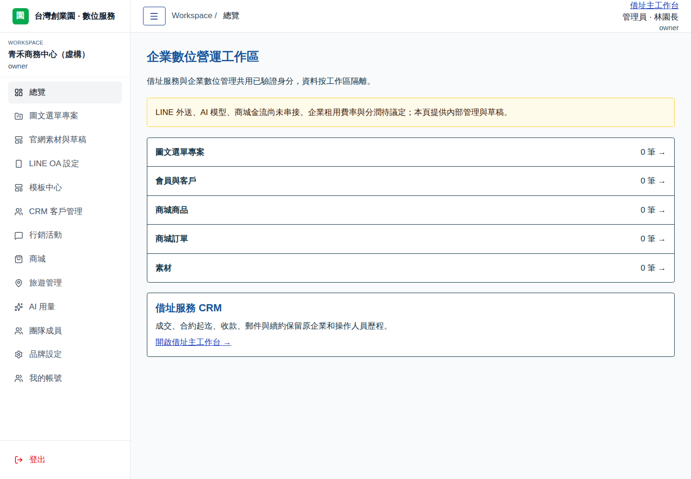
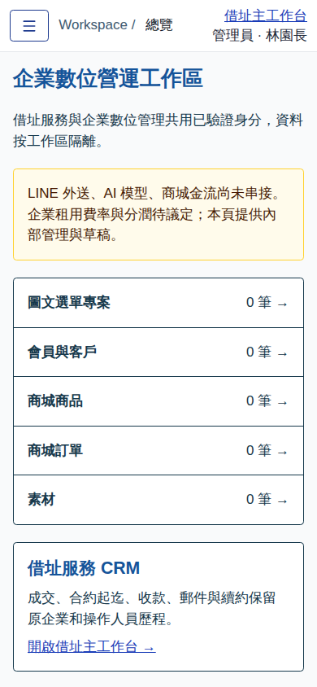

# 完整原平台執行整合與部署

本文件接續 FULL_PLATFORM_MIGRATION.md 的來源基準／工作區橋接。PLATFORM_BLUEPRINT.md 的原需求保持完整，後續商業費率與外部串接需求未刪除。

## 可操作範圍

- 完整 Smart-Menu 來源 snapshot 共 369 檔案，保留 8 個模組、原測試與 55 份 SQL；程式改動透過可核對的 build overlay 進行，原 snapshot byte/hash 不變。
- 原 Hono API 與完整 React UI 接上台灣創業園的已驗證 Access／HttpOnly session。API 由伺服器決定 operator、workspace、actor 與角色；不發原專案 bearer token，不採用來源 default 或開發帳號。
- 業者管理員在自己的業者工作區可使用原平台內部工具：圖文選單與模板、CRM 與分析、行銷草稿、商城商品／訂單、旅遊資料、經銷／佣金、點數／獎勵、AI 用量／提案介面。每個模組仍按伺服器權益判斷；缺漏不沿用來源舊版全部開通的 fallback。
- 一般業務／維運／財務使用原借址指派範圍。借址承辦關係不是進駐企業的零售 CRM 所有權。
- business_admin 必須先有有效已驗證帳號與企業 membership；企業數位權益另行核准。純借址成交不自動開通企業官網／商城／OA，也不產生數位帳款。
- CRM 中直接呈現借址企業、登記據點、承辦人、服務起迄、合約類型、付款週期，並連回原成交／合約／郵件／維運流程；不複製或重建同一借址企業。
- 上傳名片／DM（PNG、JPG，每張最多 1 MB）及社群網址，保存來源素材、公司介紹、官網草稿與確認版本。這是資料模板生成，不宣稱已做 AI／OCR；社群內容未抓取時保留連結。正式官網發布維持待議定費率／分潤狀態。
- OA 設定分開 Login 與 Messaging 資料，秘密使用現有加密主鑰、不同工作區 AAD 保存；留白保留舊值。儲存設定不代表驗證成功，不顯示無法接收的 Webhook 為可用網址。
- 延續主工作台已驗證的 signed Webhook 與管理員私有四分頁監控。一般人員的模組清單、CRM 與活動查詢不包含私有監控或企業數位操作細節。
- 舊靜態 dashboard 成功數字已改為此工作區實際資料查詢；快取按 actor／workspace／role 區分，寫入、登入狀態變更及權限拒絕清除。介面保留收合選單、條列、深色字、藍色標題及手機抽屜。

## 尚未串接／尚未開通

- 原平台工作區 OA 接收、LINE 外送、LINE Login／LIFF 企業登入、圖文選單正式發布。
- AI 模型與 OCR、社群自動擷取、AI 文案生成。
- 商城金流與公開購物入口、實際佣金匯款。
- 付費官網發布、自訂網域及企業數位訂閱。

上述需求與原功能實作保留；目前不產生假成功、不假設價格或分潤已議定。已存在的主工作台平台 OA signed receiver 與「LINE 外送未開通」分開呈現。

## 資料與素材隔離

- 借址資料庫沿用 taiwan-startup-park-prod；新增 0015／0016 為加法，保留原客戶、付款、合約和回覆人歷史。
- 完整原平台使用新專用 D1：taiwan-startup-park-platform-prod；測試版使用 taiwan-startup-park-platform-demo，與正式版及其他專案皆分離。
- 原 SQL 中 0007 測試資料不套用；54 份 schema migrations 及新的 runtime schema 套用於獨立 D1，移除來源 default／usr_dev_owner，不使用來源資料、R2 bucket 或 MLM binding。
- 目前授權沒有 R2 權限（只讀盤點 HTTP 403）。小型素材透過獨立 D1 的私有介面保存，單張上限 1 MB；驗證工作區後才可下載，回應 no-store。R2 私有儲存介面保留於規劃，之後可遷移素材 backend。
- 原前端的 standalone 帳密／團隊管理改用主工作台的驗證與管理；原 system 管理路由無隱含跨業者讀取權限。公開名片、公開 LIFF 與金流回呼需獨立驗證入口，目前未啟用。

## 建置與驗收

完整 runtime 接入須先通過三套 CI，再由 Cloudflare release 重新驗證、套用本專案 migrations 與發布。來源測試是基準回歸，不能取代本次實際 HTTP／瀏覽器驗收。

- 原來源：1222 後端＋592 前端、4 組 module typecheck、完整 bundle／Vite build、audit 0。
- 根工作台：131 個後端／權限流程測試、39 個桌面／手機測試。
- 實際完整 runtime：12 個 HTTP／遷移測試，涵蓋 Hono 真實 CRUD、跨業者與企業、停權、模組撤銷、CSRF、私有素材、秘密加密、借址 CRM 及網站確認版本；4 個瀏覽器測試，含手機全部來源模組可開啟與無頁面橫向溢出。
- 教學影片沿用原已發布素材，本輪沒有重錄。

執行副本建立於 .migration-build；scripts/prepare-platform-runtime.mjs 僅修改副本。wrangler.platform-local.json 做完整 Worker dry-run；scripts/build-platform-test-worker.mjs 以實際 Hono 執行程式及隔離 SQLite 建置測試版。這些資料和測試鑰匙不進入正式資料庫。

## 上線入口

主工作台 → 平台工作區 → 業者工作區 → 開啟完整數位工作區。

正式：https://taiwan-startup-park.fangwl591021.workers.dev/
測試：https://taiwan-startup-park-demo.fangwl591021.workers.dev/

正式版持續受 Access 保護。測試帳號切換只在獨立 demo Worker 開放；正式環境不接受 demo session 或客戶端角色。

## 最終驗收證據

實作 commit：946152be88c163ee0b8c5b56a2def4a27e3de143

- [完整來源回歸](https://github.com/fangwl591021/taiwan-startup-park/actions/runs/37707031236)：success。
- [借址工作台回歸](https://github.com/fangwl591021/taiwan-startup-park/actions/runs/37707031339)：success。
- [實際完整 runtime 驗收](https://github.com/fangwl591021/taiwan-startup-park/actions/runs/37707031251)：success。
- [完整報告與截圖](https://github.com/fangwl591021/taiwan-startup-park/actions/runs/37707031251/artifacts/11519644482)。
- docs/screenshots/platform-runtime-manifest.json 保存程式 commit、CI、圖片 SHA／大小。截圖為隔離虛構資料，已目視核對桌面／手機；不是正式客戶資料或外部 LINE／金流／AI 呼叫。

## 實際發布結果（2026-10-08）

[Cloudflare release 37708091829](https://github.com/fangwl591021/taiwan-startup-park/actions/runs/37708091829) build／deploy 均 success；重新執行全部 2000 項驗收。

發布來源 `5351289d184721b81b47e5dfa1b858e915bef892`；正式與 demo runtime flag on，分別綁定自己的新平台 D1，並保留原借址 D1。來源測試 fixture 未套用；開發帳號清除、既有加密主鑰保留、Access 及外送 off 核對通過。版本／資源／驗收界線見 [發布記錄](DEPLOYMENT_STATUS.md) 與 [非秘密核對資料](runtime-deployment-2026-10-08.json)。

首次來源 0033 的巢狀 CASE 被遷移工具提早切開；scripts/platform-migration-overlay.mjs 只在部署副本改成等價 WHEN guard，測試零餘額、足額、扣除後不足及其他工作區餘額不能混用。重新部署先驗證本次新建資料庫的精確身分、遷移前綴、schema 與沒有實際工作區，再從未完成處續行；沒有刪除或重設資料庫，也不修改原 snapshot。
