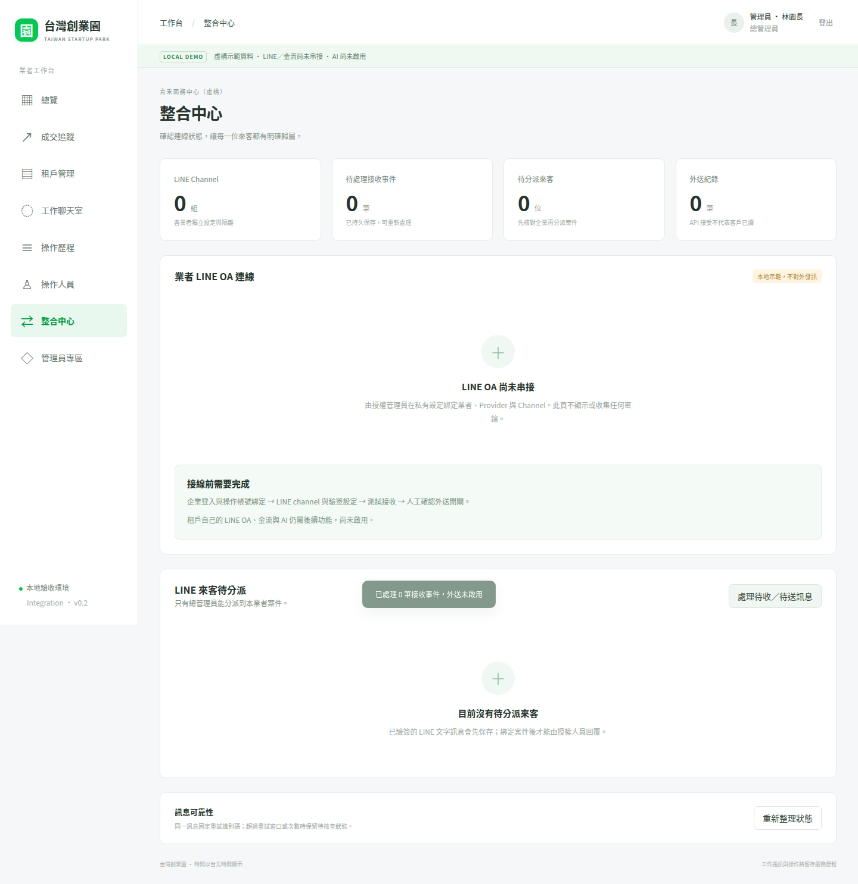
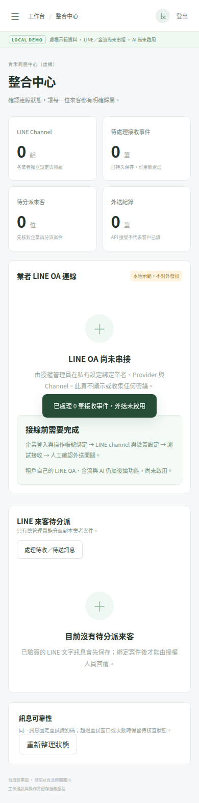

# 第二輪驗收紀錄

分支：feature/line-integration。草稿 PR：[#3](https://github.com/fangwl591021/taiwan-startup-park/pull/3)。
基底為尚未合併的 Foundation PR #2；兩輪保持獨立審查，沒有合併 main。

日期：2026-10-04。
[完整驗收 run 37202747380](https://github.com/fangwl591021/taiwan-startup-park/actions/runs/37202747380)：success。
實測程式／測試 commit：02a3459edd26c2aed073ce162ee8e4cd98a3c0f5。
截圖保存 commit：6f676fe4c634167a82eaa9e9c57e12f75182e08b。
最後文件整理只移除 CI 寫入分支權限並保留 artifact，上述應用行為不變。

## 實際結果
| 項目 | 結果 |
| --- | --- |
| npm ci / typecheck / build | 通過 |
| Wrangler dry-run | 通過，未部署 |
| 後端核心＋新增整合測試 | 30 / 30 通過 |
| Playwright 桌面／手機 | 4 / 4 通過 |
| npm audit | 當次 0 vulnerabilities |
| 原始規格 | 保留未變更 |
| 正式 Access / LINE 端到端 | 未執行，缺少正式設定 |
| Cloudflare 遠端 D1 / migration | 未執行 |
| 金流 / AI / 自動恢復排程 | 未啟用 |

本地 shell 無法啟動，改用 GitHub Actions 執行真實測試與瀏覽器截圖。
整合測試的 RSA/HMAC 為即時測試金鑰；外送使用 mock HTTP，沒有使用真實憑證或發送真實訊息。

## 新增驗證
- 簽章、issuer、audience、exp、nbf、RS256 algorithm 與個人 subject 綁定。
- Secure cookie、身分換用、停權、移除綁定、local session 不可用於正式環境。
- LINE raw bytes 驗簽、destination/channel 隔離、錯誤簽章不保存事件。
- 重送去重、來客分派權限、跨業者阻擋、不同 channel 的相同 UID 分離。
- 事件時間排序、一般收回、先收回後收到內容、重送不能恢復正文。
- 群組與非文字狀態明確為 unsupported。
- 原子 Outbox、實際 actor、固定 retry key、併發 drain 只外送一次。
- timeout 後保持 unknown，重試使用完全相同的接收者、內容與 key。
- 409 必須有 accepted-request-id；API 接受不會顯示已讀或送達。
- 停權與設定門檻阻擋、重試期限／次數限制、429 退避、租約回復。
- 較晚回來的舊請求無法覆蓋新租約完成狀態。
- 舊 Foundation migration 保留企業、session 與歷史訊息 attribution，外鍵檢查通過。
- 正式 HTTP 訊息路徑回傳 queued，拒絕由客戶端指定模擬成功／失敗。
- 原有 14 項權限及核心流程測試全部保留並通過。
- 整合中心桌面／手機無橫向溢出，業務看不到管理員整合入口。
- 手機截圖等待導覽轉場完成，已實際目視確認。

## 新畫面

## 接線前仍需完成
[LINE_INTEGRATION.md](LINE_INTEGRATION.md) 列出 Access、人員 identity、
LINE provider/channel、Webhook、私有 secret、手動啟用外送、排程恢復及真實服務驗證。
當前的 0 channel / 尚未串接畫面是實際狀態，沒有填入虛構成功連線。
沒有部署正式 Worker，沒有啟動外部金流、AI 或排程。
