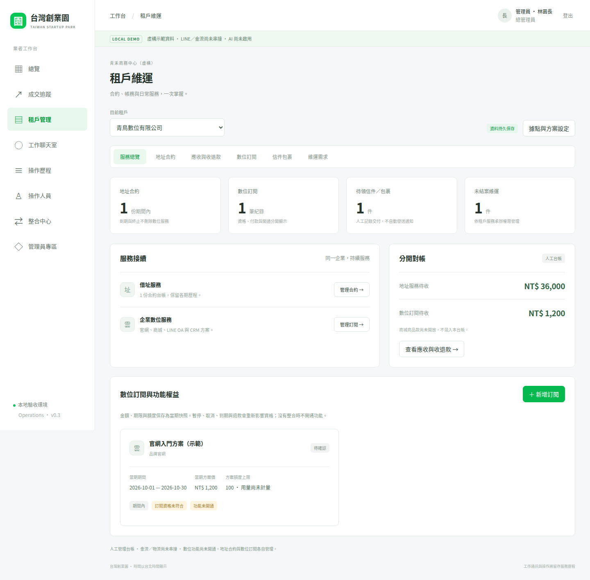
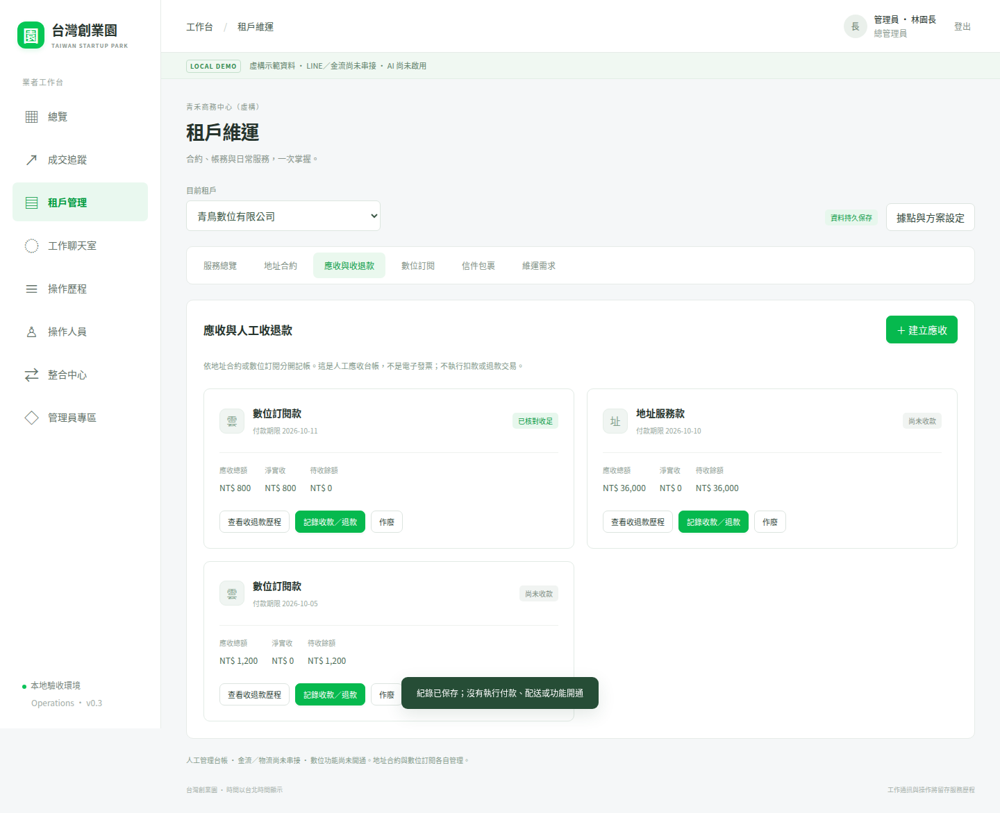
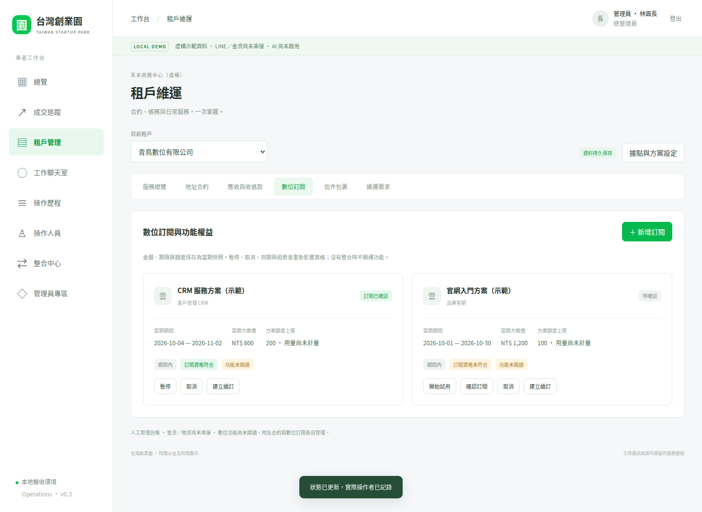
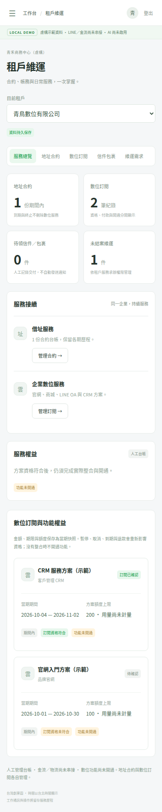
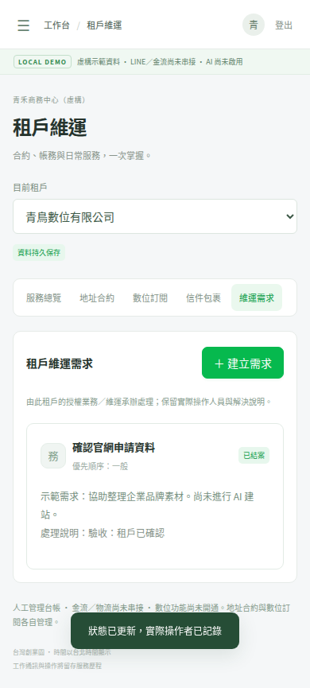

# 第三輪租戶維運驗收

- 日期：2026-10-04
- 分支：feature/tenant-operations
- 草稿 PR：[#4](https://github.com/fangwl591021/taiwan-startup-park/pull/4)，接續 #3，基底 feature/line-integration。
- 功能驗收提交：338136c1a8e701f86f9dd23e01e10f02591c1e5c
- 截圖保存提交：b07bba81640adc7765935a3ffa17f93e3c606986
- [完整功能 CI](https://github.com/fangwl591021/taiwan-startup-park/actions/runs/37204717390)
- [測試報告與截圖 artifact](https://github.com/fangwl591021/taiwan-startup-park/actions/runs/37204717390/artifacts/11304725691)

## 已執行

| 項目 | 結果 |
| --- | --- |
| npm ci | 成功，使用既有鎖定套件 |
| npm audit --audit-level=high | 0 vulnerabilities |
| npm run typecheck | 通過 |
| npm test（含 build） | 45 / 45 通過，含本輪新增 15 項 |
| npm run worker:check | dry-run 通過；84.74 KiB / gzip 19.87 KiB，沒有部署 |
| npm run test:e2e | 6 / 6 通過，含本輪新增 2 項 |
| 桌面與手機截圖目視檢查 | 已完成，手機 390 px 無橫向溢出 |
| 原始產品藍圖 | blob SHA 仍為 fcc87b90c7cc7ec6e3a5126f461fbd6ae923203b，全文未變動 |

本輪真實執行環境為 GitHub Actions 的 Node.js 22、SQLite 與 Chromium，非僅產生測試程式。修正過兩個對公開操作歷程欄位的測試假設：API 顯示 actor_name，台帳與資料庫仍保存 actor_id；最終 45 項全部通過。沒有因修正測試而放寬後端權限。

## 核心與隔離證據

- 業者／指派／角色隔離，拒絕偽造操作者與非租戶寫入；維運無帳款金額、財務無信件／需求內容。
- 合約日期與同據點有效期間重疊檢查；續約獨立建期、防重送與版本衝突；退租保留數位訂閱與聯絡人。
- 地址服務款與數位服務款分開；不允許商城款、錯誤來源或同一期重開應收。
- 部分收款、原收款連結退款、超收／超退拒絕、不可改寫或刪除台帳、實際財務操作者歸屬。
- 同版本競爭僅一筆入帳及一筆操作歷程；重送同請求不重複記帳，換內容拒絕。
- 作廢需淨實收零元，作廢後不得新增收款。
- 方案停售保留價格快照；訂閱需足額核對、試用／暫停／恢復／取消、台北首末日邊界、重疊期間、下一期續訂。
- 退款後資格失效；資格不符 403、符合但模組未串接 503，enabled 永遠為 false。
- 指派維運收件、交付依據與狀態版本；需求處理、解決、結案及角色可見歷程。
- 舊成交、LINE adapter、登入、訊息操作者及發送可靠性測試全部保留並通過。

## 畫面證據

所有畫面只含虛構 fixture 與 UI 測試資料；測試帳款不是正式收款。

## 本次界線

沒有部署 Worker、套用遠端 migration、正式排程、真實 LINE 外送、實際金流／退款、物流通知、AI 分析或模組開通。未驗證正式 Cloudflare D1／Access／LINE 外部系統。收退款是人工台帳，非電子發票；方案額度尚未計量；正式法律契約、網站／商城生成與 AI 風控依完整藍圖保留後續實作。

CI 截圖保存後恢復 contents: read，不保留自動推送步驟。後續執行仍透過 artifact 保存驗收證據。
